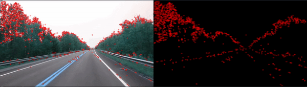

# I am a developer.

### Contacts

[][angellist]

 

### Languages and Tools which I use
[][webdevplaylist]
[][webdevplaylist]
[][webdevplaylist]
[][webdevplaylist]
[][cssplaylist]
[][cssplaylist]
[][jsplaylist]
[][reactplaylist]
[][webdevplaylist]
 
 
[][webdevplaylist]
[][webdevplaylist]
[][webdevplaylist]
[][webdevplaylist]
[][webdevplaylist]
[][webdevplaylist]
 
 

---

[website]: https://JastonMatter.com
[twitter]: https://twitter.com/JastonMatter
[linkedin]: https://linkedin.com/in/JastonMatter
[webdevplaylist]: https://github.com/Johk3
[jsplaylist]: https://github.com/Johk3
[cssplaylist]: https://github.com/Johk3
[reactplaylist]: https://github.com/Johk3
[angellist]: https://angel.co/u/johannes-leppakorpi
